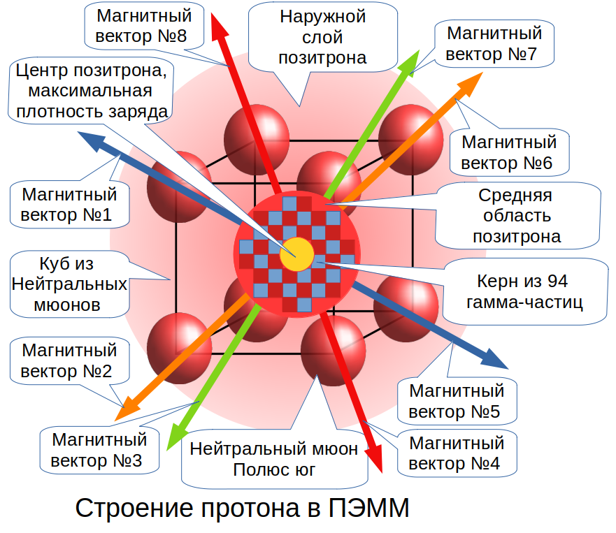

<!DOCTYPE html>
<html lang="ru">
<head>
    <meta charset="UTF-8">
    <meta name="viewport" content="width=device-width, initial-scale=1.0">
    <title>Позитронно-Электронно-Мюонная Модель (ПЭММ)</title>
    
</head>
<body>

    <h1>Позитронно-Электронно-Мюонная Модель (ПЭММ) — Фундаментальный Чертеж Вселенной</h1>

    

        
<strong>УДК:</strong> 53.072

        
<strong>Текущий DOI публикации:</strong> <a href="https://doi.org" target="_blank">10.5281/zenodo.20108815</a>

        
<strong>Полная документация ПЭММ (232 стр.):</strong> <a href="https://doi.org" target="_blank">DOI: 10.5281/zenodo.19864750</a>

        
<strong>Международный ORCID автора:</strong> <a href="https://orcid.org" target="_blank">0009-0005-4567-9701</a>

        
<strong>Автор модели:</strong> Владимир Балтрунас, инженер-физик (выпускник магистратуры МИФИ).

    

    <h2>1. Закон сохранения энергии — материя не превращается в энергию и наоборот</h2>
    
ПЭММ — это не вопрос веры, это вопрос выживания человеческой цивилизации. Согласно модели, материя принципиально не превращается в абстрактную чистую энергию. Общепринятая концепция «аннигиляции» на субквантовом уровне представляет собой процесс образования электрического диполя — гамма-частицы (темной энергии) из жестких зарядов позитрона и электрона с полным сохранением их заряда и исходных масс в условиях сверхплотного сжатия. Вселенная материальна на абсолютно всех уровнях: физической «пустоты» или «чистой энергии» без материального корпускулярного носителя в природе не существует.

    <h2>2. Фундаментальная структура микромира: Протон и Нейтрон</h2>
    
В ПЭММ полностью отсутствует вероятностное описание элементарных частиц. Направление полей и взаимодействия определяются строгой пространственной геометрией нуклонных матриц.

    <!-- БЛОК С КАРТИНКАМИ ПРОТОНА И НЕЙТРОНА -->
    

        

            
            
Строение протона в ПЭММ: кубический мюонный каркас и октаэдрический керн

        

        

            
            
Строение нейтрона в ПЭММ: протон внутри деформированной электронной оболочки

        

    

    
<strong>Протон</strong> — это жесткий кубический каркас. Его пространственная стабильность обеспечивается одним позитроном и 8 нейтральными мюонами, образующими вершины куба. Внутри кубического остова заперт плотный керн из 94 гамма-частиц (диполей электрон-позитрон), уложенных в форме правильного октаэдра. Это сверхплотная материя микромира, обладающая 8-ю магнитными векторами, создаваемыми гравитационными зарядами мюонов и зарядом позитрона. Данная геометрия векторов полностью определяет валентность всех химических элементов в таблице Менделеева (восемь столбцов). Протон имеет восемь магнитных полюсов «юг» за счет положительного заряда позитрона.

    
    
<strong>Нейтрон</strong> — это не самостоятельная элементарная частица, а составная упругая система, представляющая собой протон внутри электрона. Нейтрон имеет восемь магнитных полюсов «север». При этом доля в +0,35e заряда позитрона заперта в октаэдрическом керне, а снаружи керна находится +0,65e. Весь заряд внешнего поглотившего электрона находится вне керна протона (отрицательный заряд не может преодолеть кулоновский барьер и попасть внутрь керна), поэтому суммарный заряд позитрона и электрона вне керна составляет -0,35e, что обеспечивает макроскопическую электронейтральность системы.

    <h2>9. Рождение «строительного материала» звезд и планет</h2>
    
Центральная черная дыра ядра накапливает критическую массу из нейтральных мюонов, гамма-частиц и квантов среды. Это приводит к спонтанному механическому синтезу нейтронов, огромному выделению кинетической энергии и, самое главное, — к прогрессирующему накоплению дефекта заряда внутри черной дыры. Когда суммарный отрицательный заряд перевешивает силы гравитационного притяжения, происходит мощный кулоновский взрыв.

    
При взрыве сверхновой звезды целыми протонами и нейтронами остается только ничтожно малая часть материи. Практически вся разлетающаяся образовавшаяся материя — это свободные нейтральные мюоны (темная материя), жесткие гамма-частицы (темная энергия) и гамма-кванты в виде кинетического излучения полей. Именно этот первичный «строительный материал» формирует новые поколения звезд и запускает в них термоядерные реакции.

    <h2>10. Прикладное значение ПЭММ</h2>
    
<strong>Термоядерный синтез (отрицательный баланс):</strong> Чтобы собрать дейтрон из протона и атома водорода, системе критически не хватает массы (дефицит −0,000646 а.е.м. или -0,6016 МэВ). Системе просто не хватает энергии на испускание двух гамма-частиц. Возможная реакция образования дейтрона осуществима исключительно из свободного нейтрона и атома водорода, но естественного источника нейтронов (кроме реакций деления тяжелых ядер) на Земле нет, что делает многомиллиардные макропроекты (Токамаки, ITER) тупиковым путем.

    
<strong>Техногенные аварии:</strong> Понимание жесткой кубической структуры ПЭММ и процессов внутриядерного разуплотнения позволяет физически точно объяснить природу и скрытые причины техногенных аварий, включая взрыв на Чернобыльской АЭС и метровую прожженную дыру в корпусе макрореактора Фукусимы.

    
<strong>Физиология и медицина:</strong> ПЭММ детально описывает работу сетчатки человеческого глаза по прямой аналогии с полупроводниковой солнечной панелью через механическое разделение диполей гамма-кванта на позитронные и электронные кванты и передачу квантового активного тока по проводящим молекулам. Модель также обосновывает стотысячекратное сжатие нитей ДНК в ядре клетки (эффект работы протонного пресса) и феноменальное долголетие морских полипов.

    
<strong>Макроэволюция Солнечной системы:</strong> Солнце не является вечным двигателем. За 4,5 млрд лет его общая светимость за счет истощения запаса темной материи и темной энергии в ядре упала на 60%. Планета Марс из-за меньшего объема остыла первой. Земля к текущему моменту эволюции уже остыла более чем на 100 градусов. В то время как Стандартная модель ошибочно прогнозирует будущий рост яркости Солнца, ПЭММ ставит жесткий прикладной диагноз — прогрессирующее замерзание и новые ледниковые периоды. Без ПЭММ и понимания реальной сборки ядер человечество не успеет включить технологический «обогрев» Земли.

</body>
</html>
